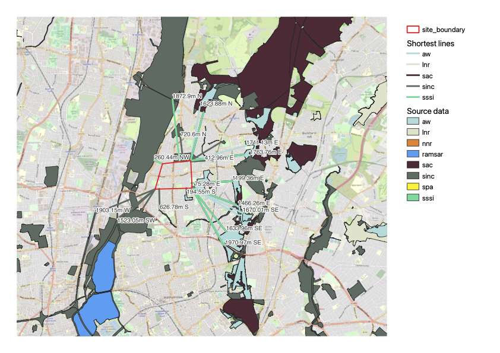
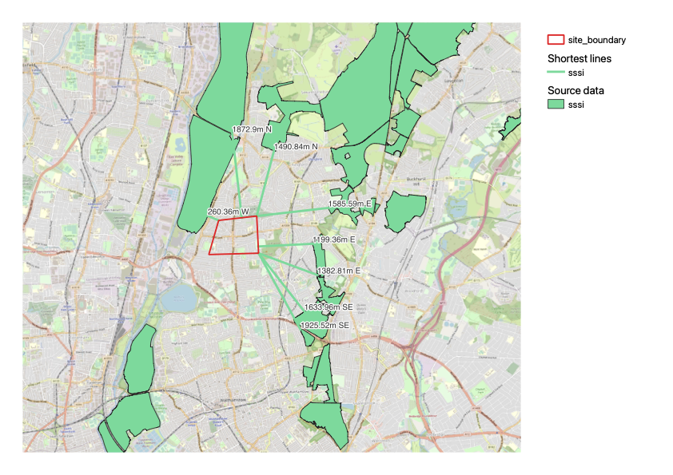

# Designated Site Search

## Description

A python script to perform a search for nearby designated sites, which is regularly performed as part of ecological or environmental assessments either manually or at cost through a third party. The script can be adapted to use the layers directly from ArcGIS FeatureServers, or these can be exported to a GeoPackage which speeds up runtime significantly. The script exports a CSV containing all the source attributes for each layer as well the distance from site, bearing, and compass direction.

The script is designed to be used within [QGIS](https://www.qgis.org/en/site/)'s Python Console, as it utilises memory layers. It can be adapted to run as a standalone script and the output saved to a ShapeFile by adding QGIS Python to PATH and importing the relevant modules listed [here](https://docs.qgis.org/3.22/en/docs/pyqgis_developer_cookbook/cheat_sheet.html). 

## Usage

- Edit the file paths for your site boundary ShapeFile.
- **If working with a GeoPackage of designated sites**, edit the file path and ensure the `"|layername="` matches your own.
- Otherwise, uncomment the FeatureServer layers and comment out the GeoPackage lines.
- Edit the file paths for the exported CSVs.
- Edit the `distance` value and run.

## Advantages

The script utilises the native QGIS algorithm [Shortest line](https://doc.qgis.org/testing/en/docs/user_manual/processing_algs/qgis/vectoranalysis.html#shortest-line-between-features), which has several advantages over using a traditional buffer and intersection analysis.

- As lines are plotted rather than features being clipped to a buffer, the original designated site features are retained which contextualises their size and location.
- Line features allows the calculation of a bearing value and compass direction through interpolate, which also provides further context of where a designated site is *relative* to the our site boundary.

## Limitations

- Each designated site may contain varying levels of data quality, and full details are constrained to a paid data search from a Local Environmental Records Centre (LERC). 
- The Sites of Importance for Nature Conservation (SINC) FeatureServer used in this script is limited to Greater London.

## Example outputs

A typical output of a random site boundary drawn in North London, with multiple designated sites within 2km. 

The same site but only showing nearby Sites of Special Scientific Interest (SSSI). This highlights the additional context captured by retaining the full site polygon and the labels featuring distance and compass direction at the closest point of the polygon, achieved through the x and y endpoints.

